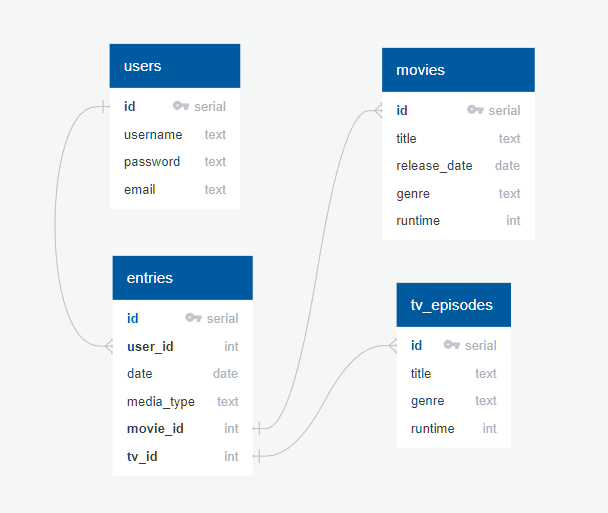
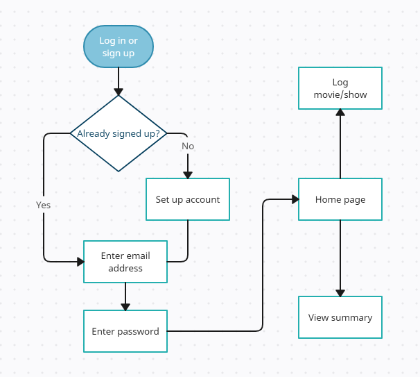

# Capstone I Proposal &rarr; Media Memoir

## Overview

**_Media Memoir_** is an application that will allow users to register, login, keep a log of movies and tv shows they watch, see information about the movies and tv shows they watch, and view watch summaries and statistics. The [TMDB API](https://www.themoviedb.org/documentation/api) provides access to a wealth of information and data points on movies and tv shows that will be utilized.

## Goals

The goal of the website is to create a sort of online journal for users that want to look back and remember what and how many movies and tv shows they've watched. With the ever increasing availability of movies and tv shows to watch on countless streaming services, people are watching many different things without a single place to log and keep track of their viewing histories.

## Target Users

The target demographic is primarily fans of movies and tv shows, obviously with Netflix addicts sprinkled in. Basically, anyone curious about their viewing history is who this is built for.

## Data

I plan on using the [TMDB API](https://www.themoviedb.org/documentation/api) and/or the [OMDb API](http://www.omdbapi.com/). I plan on pulling main data points relevant to movies/tv shows (title, rating, genre, runtime, release date, etc.)

## Approach

### DB Schema

### Issues

API could pull incorrect movie/show information if duplciate names of movies/shows exist.

### Sensitive Information

User login passwords

### Functionality

Log user entries of movies and tv episodes watched
Offer summary page showing number of movies/tv episodes watched
Display specific info of watched movies/tv episodes (titles, genres, release dates, runtimes, etc.)

### User Flow

* User log in or sign up
* Home page has link to Summary page and link to Log A Movie/Show page
  * Log A Movie/Show page contains form
  * Summary page shows summary of user stats

### Stretch Goals

* Add additional fields to media log form
  * Movie watched for first time or repeat
  * Movie watched in a theater or somewhere else
  * Movie watched with others or alone
* Add movie and tv posters/images to summary page
* Add feature to view summary by month or week
* Allow user to download their viewing history as csv
* Add feature to allow users to mark movies/tv shows as favorites